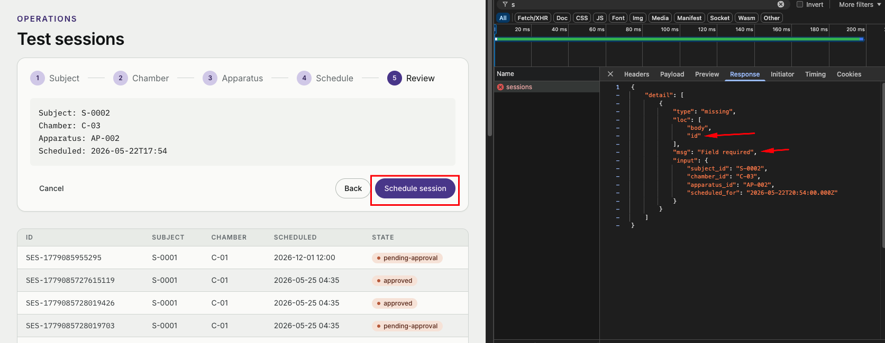

# AUDIT.md

# Iris Sciences — QA Audit Memo

# Quarterly Enrichment Index (QE Index)

The public-facing QE Index currently displayed by Iris Sciences is **87.4%**.

During testing, both the operational dashboard and its API consistently returned a different canonical value:

> **22.204%**

Dashboard API response:

```json
{
  "qe_index": 22.204,
  "sessions_counted": 2744,
  "cutoff": "1971-09-14T14:22:08",
  "legacy_multiplier": 0.4,
  "exclusions_applied": 3
}
```

Based on the available operational data, I could not validate the public value of `87.4%`. The internally exposed canonical metric consistently points to `22.204%`, which suggests that the public KPI is either outdated, calculated differently, or incorrect.

---

# Findings

## BUG-01 — Public QE Index does not match canonical operational value

**Severity:** Critical
**Regression-worthy:** Yes
**Is-automated:** No

### Steps to reproduce

1. Observe the public QE Index value (`87.4%`)
2. Open the operational dashboard
3. Inspect the dashboard API response
4. Observe the QE Index value (`22.204%`)

### Expected

The public and internal QE values should either match or clearly explain why they differ.

### Actual

The values differ significantly with no explanation.

### Why this matters

This is the platform’s main KPI, so inconsistent reporting creates a major business and credibility risk.

---

## BUG-02 — Session data is lost after authentication

**Severity:** Critical
**Regression-worthy:** Yes

### Steps to reproduce

1. Create or modify session-related data
2. Log into the platform
3. Observe session state/data

### Expected

Session data should persist after login.

### Actual

Session-related data is lost after authentication.

### Why this matters

Losing session data directly impacts core operational workflows.

---

## BUG-03 — Approve and Reject actions do not work via UI

**Severity:** High
**Regression-worthy:** Yes
**Is-automated:** No

### Affected areas

* Dashboard
* Approvals page

### Steps to reproduce

1. Open pending approvals
2. Click Approve or Reject

### Expected

The approval status should update.

### Actual

Nothing happens.

### Why this matters

This blocks one of the main documented workflows.

---

## BUG-04 — Session creation cannot be completed through the UI

**Severity:** High
**Regression-worthy:** Yes
**Is-automated:** Yes

### Steps to reproduce

1. Open the Sessions page
2. Select a subject, assign a chamber, allocate apparatus, choose a
time window, and submit for approval.
3. Attempt to create/save a session

### Expected

The session should be saved successfully.

### Actual

The session cannot be saved through the frontend flow.

### Why this matters

This prevents users from completing one of the platform’s primary workflows.

### Error



---

## BUG-05 — PDF and Operator Format exports do not work

**Severity:** High
**Regression-worthy:** Yes
**Is-automated:** No

### Steps to reproduce

1. Open Reports
2. Attempt PDF export
3. Attempt Operator Format export

### Expected

Export files should be generated successfully.

### Actual

No export is generated.

### Why this matters

reports/exports functionality is part of the documented operational flow.

---

## BUG-06 — Test Subject role can see unauthorized actions

**Severity:** High
**Regression-worthy:** Yes
**Is-automated:** No

### Steps to reproduce

1. Login as Test Subject
2. Observe available buttons/actions

### Expected

The role should only be able to view its own records and session history.

### Actual

Privileged actions and controls are still visible.

### Why this matters

Permission boundaries are not being enforced correctly.

---

## BUG-07 — Search functionality does not work

**Severity:** Medium
**Regression-worthy:** Yes
**Is-automated:** No

### Affected searches

* Subjects
* Chambers
* Sessions

### Steps to reproduce

1. Go to any page, there is a search bar on the top
2. Type a subject, chamber or session and hit Enter key

### Expected

Relevant search results should appear.

### Actual

Nothing happens after searching.

### Why this matters

Search is a core navigation and usability feature.

---

## BUG-08 — Search for Subject fails for valid identifiers

**Severity:** Medium
**Regression-worthy:** Yes
**Is-automated:** No
### INFO
    The search works correctly when only numbers are entered in the search field.

### Steps to reproduce

1. Go to Subject page
2. Type `S-0001` on the search field

### Expected

The matching subject record should appear.

### Actual

The subject is not returned.

### Why this matters

Valid operational data cannot be retrieved consistently.

---

## BUG-09 — Undefined values displayed in Subject page

**Severity:** Low
**Regression-worthy:** No
**Is-automated:** No

### Steps to reproduce

1. Go to Subject page
2. Wing column displays `undefined`

### Expected

A valid value or a proper empty state.

### Actual

Raw `undefined` value is rendered.

---

## BUG-10 — Dashboard uses a suspicious historical cutoff date

**Severity:** Medium
**Regression-worthy:** No
**Is-automated:** No

### Observed value

* `1971-09-14T14:22:08`

### Expected

A valid operational cutoff date.

### Actual

A historically implausible date is returned.

### Why this matters

This may indicate legacy-data or migration issues affecting calculations.

---

## BUG-11 — Homepage contains broken navigation links

**Severity:** Medium
**Regression-worthy:** Yes
**Is-automated:** No

### Affected links

* Explore Programs
* All Programs
* All Subjects

### Expected

Navigation should open valid pages.

### Actual

The links return a 404 page.

### Why this matters

Broken navigation impacts usability.

---

## BUG-12 — Multiple homepage sections are non-interactive

**Severity:** Low
**Regression-worthy:** No
**Is-automated:** No

### Affected modules

* Current Programs
* Subject Spotlight
* Annual Reports

### Expected

Sections should react to user interaction.

### Actual

Nothing happens when clicked.

### Why this matters

Low business impact, but it creates a broken/incomplete experience.

---

## BUG-13 — Homepage images do not load

**Severity:** Low
**Regression-worthy:** No
**Is-automated:** No

### Expected

Images should render correctly on the Lifelong enrichment trajectories.

### Actual

Images fail to load.

### Why this matters

Visual quality and credibility are affected.

---

## BUG-14 — Dashboard trend graph conflicts with visual indicator

**Severity:** Low
**Regression-worthy:** No
**Is-automated:** No

### Steps to reproduce

1. Resize the viewport to a smaller resolution
2. Observe dashboard charts/cards

### Affected area

* Subjects Enrolled chart
* Sessions in QE roll-up

### Expected

The graph trend should match the upward/downward indicator.

### Actual

The chart visually decreases while the indicator suggests growth.

The chart are currently static images, and depending on the screen size, they can overlap with other elements, causing responsiveness issues.

### Why this matters

This creates misleading analytics visualization.

---

## BUG-15 — Recent Activity table has no column headers

**Severity:** Low
**Regression-worthy:** No
**Is-automated:** No

### Steps to reproduce

1. Go to Dashboard page

### Expected

The table should contain headers for clarity.

### Actual

No headers are displayed.

### Why this matters

This reduces readability and accessibility.

---

## BUG-16 — Recent Activity uses inconsistent status colors

**Severity:** Low
**Regression-worthy:** No
**Is-automated:** No

### Steps to reproduce

1. Go to Dashboard page

### Expected

The same statuses should always use the same colors.

### Actual

Status colors are inconsistent.

### Why this matters

Visual consistency is reduced.

---

## BUG-17 — Chamber naming conventions are inconsistent

**Severity:** Low
**Regression-worthy:** No
**Is-automated:** No

### Steps to reproduce

1. Go to Chamber page

### Expected

Chamber naming and wing conventions should be standardized.

### Actual

Naming format varies between records.

---

## BUG-18 — Chamber C-Δ-7 shows malformed detail state

**Severity:** Medium
**Regression-worthy:** No
**Is-automated:** No

### Steps to reproduce

1. Go to Chamber page

### Observed message

* “Detail temporarily unavailable.”

### Expected

A valid chamber detail page.

### Actual

- The chamber detail view is unavailable or malformed.
- The chamber shows as active, and this can be selected when creating the session.

### Why this matters

This appears to be an isolated data/display issue.

---

## BUG-19 — Schedule flow allows past dates

**Severity:** Medium
**Regression-worthy:** Yes
**Is-automated:** No

### Steps to reproduce

1. Open the scheduling flow
2. Select a past date

### Expected

Past dates should be blocked.

### Actual

Past dates are accepted.

---

## BUG-20 — Audit severity filter does not work

**Severity:** Medium
**Regression-worthy:** Yes
**Is-automated:** No

### Steps to reproduce

1. Open the Audit page
2. Apply severity filter

### Expected

Results should be filtered correctly.

### Actual

Filtering does not occur.

### Why this matters

Filtering is important for audit workflow usability.

---

## BUG-21 — “Select a subject for detail” module is non-functional

**Severity:** Low
**Regression-worthy:** No

### Steps to reproduce

1. Navigate to the Subject page
2. Interact with the “Select a subject for detail” module

### Expected

Selecting a subject should display the corresponding detail information.

### Actual

Nothing happens when interacting with the module.

### Why this matters

This impacts subject-detail navigation and prevents users from accessing operational information efficiently.

---

## BUG-22 — Pending approvals section does not display requester information

**Severity:** Low
**Regression-worthy:** No

### Affected areas

* Dashboard
* Approvals page

### Expected

Each approval request should display the requester (“requested by”) information.

### Actual

Requester information is missing.

### Why this matters

This reduces traceability and makes approval decisions less reliable for operators.

---

# Methodology

I approached the assessment using a mix of exploratory testing, workflow validation, and risk-based prioritization.

Testing started with the officially documented workflows:

* scheduling sessions,
* approval lifecycle,
* and reporting/export functionality.

I used the API documentation available through `/docs` to compare frontend behavior against backend responses. Browser developer tools were used heavily throughout the process to inspect requests, responses.

Most of the testing effort focused on:

1. core operational workflows,
2. permission boundaries,
3. reporting accuracy,
4. lifecycle/state validation,
5. and usability issues that could impact operators.

A significant portion of the investigation focused on the Quarterly Enrichment Index because it is described as the platform’s primary KPI. During validation, the public value (`87.4%`) could not be reconciled with the canonical value (`22.204%`) consistently returned by the operational dashboard API.

Additional exploratory testing also revealed indicators of undocumented application surface area, including hidden/internal roles exposed through API responses.

If I had additional time, I would continue investigating:

* authorization escalation scenarios,
* lifecycle manipulation through direct API calls,
* export validation,
* QE Index formula reconstruction,
* and broader negative-path API coverage.
